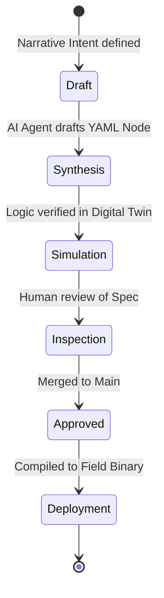

# GOVERNANCE.md: Repository & Project Standards

This document defines the strictly enforced settings and workflows for **openIronSDA** projects. Adherence is mandatory for **Rank Ω Compliance**.

## ⚙️ GitHub Repository Configuration

### General Settings
- **Repository Name**: follows `kebab-case` (e.g., `water-treatment-dcs`).
- **Template Repository**: **MUST** be enabled.
- **Default Branch**: `main`.

### Pull Request & Merge Workflow
- **Allow Squash Merging**: Enabled (preferred for clean intent history).
- **Require Signed Commits**: Enabled (Axiom 70 verification).
- **Automatically delete head branches**: Enabled.
- **Branch Protection**: 
    - Require pull request reviews before merging.
    - Require status checks to pass (MD Lint, Spec Validation).

### Features
- **Discussions**: Enabled for "Intent Refinement" conversations.
- **Issues**: Enabled for "Bug/Anomaly" tracking in the spec.
- **Releases**: **Enable Release Immutability**. Assets and tags must not be modified once published.

## 🔄 Intent Flow Workflow

## 🛡️ Anti-Requirements (Prohibited Items)
1.  **NO BINARIES**: Do not commit compiled `.bin` or `.exe` files.
2.  **NO SECRETS**: All hardware credentials must be stored via Sovereign Secret Management (SSM), never in plain text YAML.
3.  **NO LEGACY MENTIONS**: Avoid referencing proprietary vendor systems (e.g., [REDACTED]) in commit messages or docs.

---
*Governance is the framework of Trust.*
