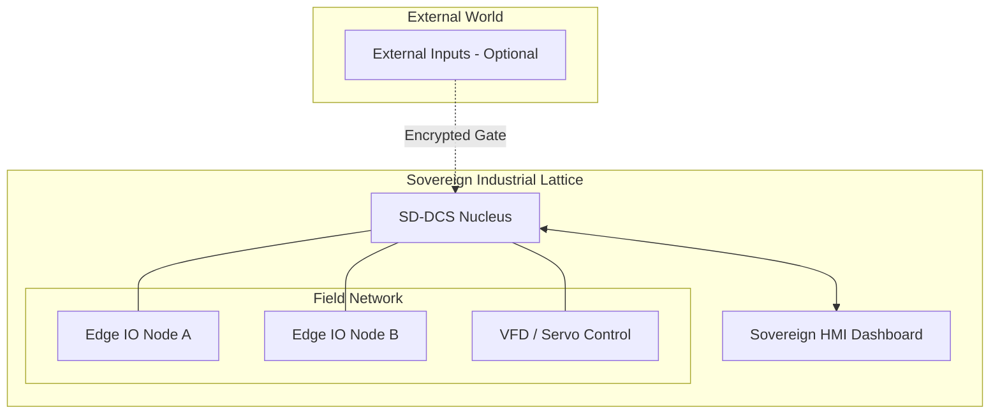

# MISSION.md: openIronSDA Core Intent

## 🎯 Goal
To provide a de-facto standard for **AI-Native Industrial Automation** by formalizing the transition from "Vendor Locking" to **"Intent Sovereignty."**

## 🏗️ Technical Methodology
openIronSDA operates on the **Dual-Sovereign Substrate**:
1.  **Specification Sovereignty**: The user defines the "Why" and "What" in structured Markdown and YAML.
2.  **Execution Sovereignty**: The AI Agent synthesizes the "How" onto open-source, hardened runtimes (e.g., OpenPLC-Next, Rust-native kernels).

## 📐 DCS Topology (The Foundry Model)

## 🛡️ Sovereign Constraints (Axioms)
- **Axiom 1 (Localism)**: All critical DCS logic resides within the physical site.
- **Axiom 2 (Traceability)**: Every operational change must be traceable to a specific Human Intent entry in the ledger.
- **Axiom 3 (Hardened Privacy)**: Industrial telemetry is never leaked to public clouds; all analytics are on-prem.

---
*The Intent is the Sovereign. The Spec is the Contract.*
