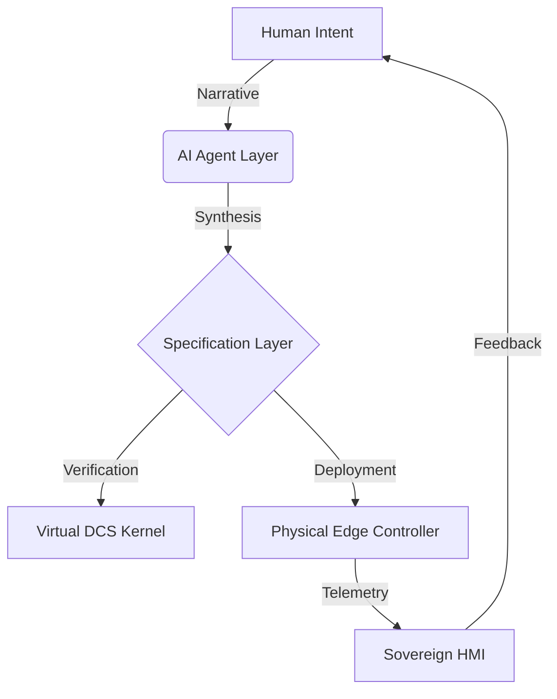

# openIronSDA 🦀⚙️ (Intent-First SD-DCS)

> **"Traditional DCS Architectures are the fossils of the industrial age. openIronSDA is the living intent of the future."**

**openIronSDA** is a documentation-centric, AI-native template for architecting **Software-Defined Distributed Control Systems (SD-DCS)**. It leverages the **Sovridium Foundry** ideology to move beyond legacy proprietary specifications into a future of **Intent-Driven Development (IDD)**.

## 🛰️ Vision: Specification as Code
This repository contains **NO SOURCE CODE**. It is a pure specification substrate. The "Logic" is synthesized by AI Agents from the high-level narratives and **Intent-YAML** nodes defined herein.

### Core Pillars
- **Sovereign Intelligence**: Local-first control logic with private telemetry.
- **Intent-First Flow**: Control loops defined as FBP (Flow-Based Programming) YAML nodes.
- **Spec-Verified Safety**: Formal verification of intent through simulation-native specs.

## 🏗️ System Architecture

## ⚙️ GitHub Template Configuration
To use this as a **Foundry-Native Template**, ensure the following GitHub settings are enabled:

| Setting | Value | Rationale |
| :--- | :--- | :--- |
| **Template Repository** | `Enabled` | Allows instant spawning of new DCS projects. |
| **Release Immutability** | `Enabled` | Prevents tampering with safety-critical specs. |
| **Wiki / Issues** | `Enabled` | Collaborative intent refinement and tracking. |
| **Auto-delete head branches** | `Enabled` | Maintains a clean "Intent Ledger" (Git). |
| **Restrict Editing** | `Collaborators Only` | Ensures Rank Ω integrity. |

## 🚀 Getting Started
1. **Click "Use this template"** in GitHub.
2. **Define your MISSION.md**: State the high-level purpose of your DCS.
3. **Draft Intent Nodes**: Create your control logic in `/nodes/`.
4. **Instantiate Agents**: Point your Antigravity Agent at this repo for synthesis.

---
*Built with Rank Ω integrity for a sovereign industrial future.*
