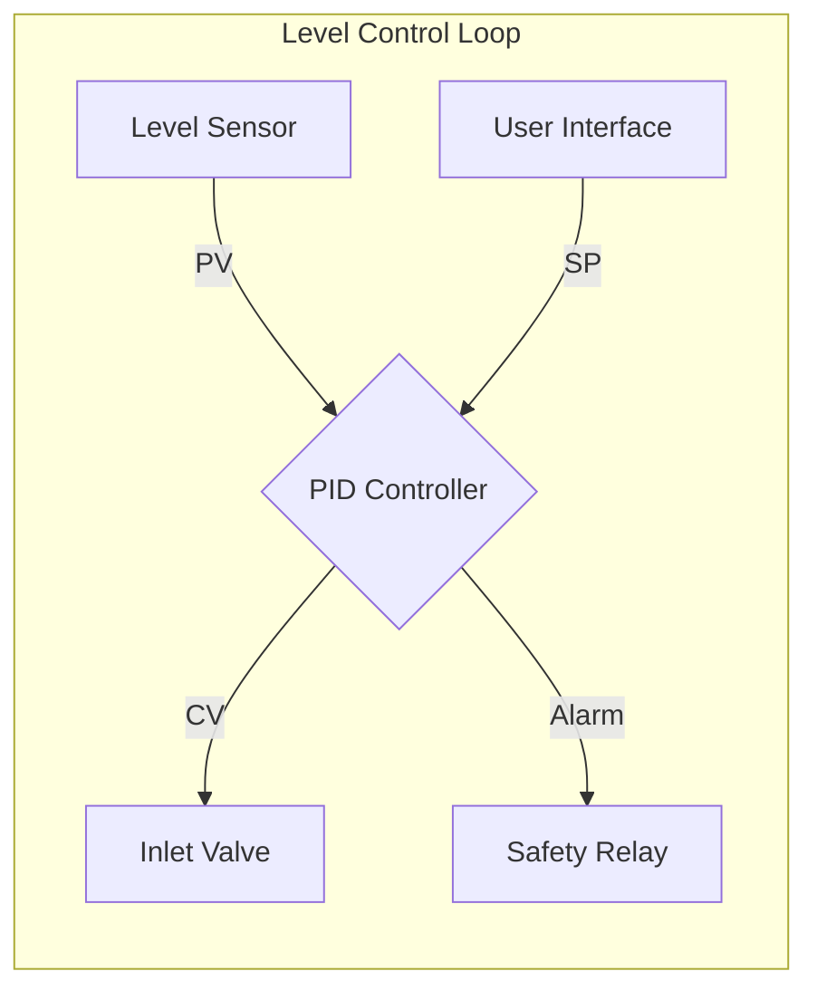

# Architectural Guide: Flow-Based Intent (FBI)

In **openIronSDA**, we do not "program" control logic; we define **Intent Flows**.

## 1. What is an Intent Flow?
An Intent Flow is a directed acyclic graph (DAG) where nodes represent **Functional Intents** and edges represent **Sovereign Telemetry**.

### The FBP Model
We use Flow-Based Programming (FBP) principles where:
-   **Nodes** are black boxes with distinct Inlets and Outlets.
-   **Edges** are asynchronous data streams.
-   **Intent** sits above the node, describing *why* it exists.

## 2. Diagrammatic Standard
Every flow MUST be visualized using Mermaid.

## 3. The YAML Connection
Each node in the Mermaid graph corresponds to a file in `nodes/*.yaml`. For example, the `PID Controller` above would be mapped to `nodes/level_pid_controller.yaml`.

## 4. Synthesis and Verification
The primary role of the Agent is to:
1.  **Traverse the Graph**: Check for circular dependencies or logic gaps.
2.  **Verify Safety**: Ensure that No-Go paths are explicitly interlocked in the YAML logic scaffold.
3.  **Generate Evidence**: Produce a "Traceability Matrix" showing that every physical actuator is controlled by a legitimate intent node.

---
*Logic is the byproduct of well-defined Intent.*
