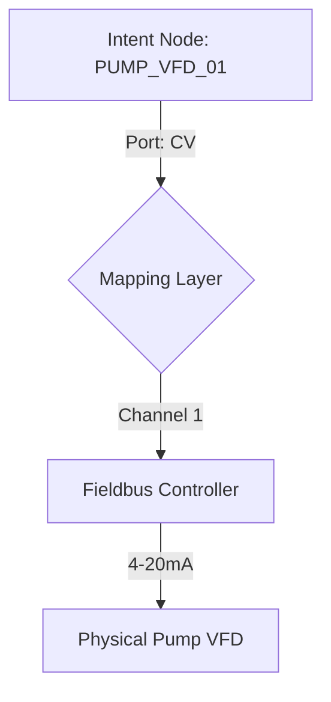

# Spec 001: Sovereign Hardware I/O Mapping

## 1. Intent
To decouple high-level control logic from physical fieldbus addresses (EtherCAT, Modbus, etc.). This ensures that the **Intent** remains valid even if the underlying hardware platform changes.

## 2. Methodology
Hardware mapping is handled via an abstraction layer called the **"Foundry HAL (Hardware Abstraction Layer)."**

### Mapping Process
1.  **Logical Port**: Defined in `nodes/*.yaml`.
2.  **Mapping Node**: A bridge record that links the Logical Port to a Physical Slot.
3.  **Sanity Check**: Verification that the physical properties (Voltage, Precision) match the node requirements.

## 3. Visualization

## 4. Safety Constraints
-   All mapping nodes must support "Fail-Scale" behavior (e.g., Output 0V on network loss).
-   Mapping changes must require a **Verified Human Signature**.

---
*Identity is logical; mapping is physical.*
